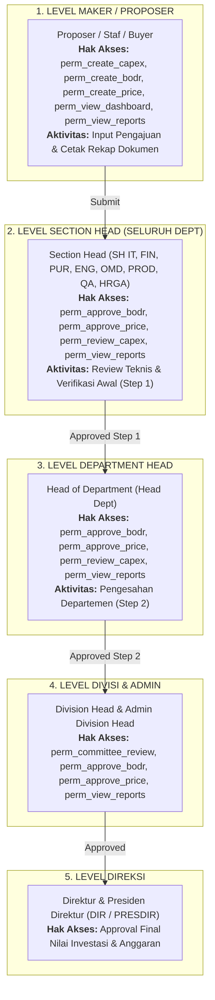

# Laporan Eksekutif Konfigurasi & Tata Kelola Sistem Portal Terpadu
**PT Menara Terus Makmur (Astra Otoparts Group)**  
*Edisi Revisi Resmi: Penambahan Role Struktural Section Head (SH) Seluruh Departemen, Pemisahan Peran Maker vs Approver, dan Matriks Hak Akses 12 Role*

---

## 1. Latar Belakang & Tata Kelola Pemisahan Peran (*Segregation of Duties*)

Sistem Portal Terpadu PT Menara Terus Makmur mengintegrasikan tiga pilar proses bisnis belanja modal dan operasional: **Portal CAPEX**, **Portal BODR**, dan **Portal Otorisasi Harga**. 

Sistem menerapkan prinsip **Pemisahan Peran Tegas (*Segregation of Duties / SoD*)** di mana pembuat usulan (*Maker*) tidak diizinkan menyetujui pengajuannya sendiri, dan setiap pengajuan diverifikasi berjenjang mulai dari tingkat **Section Head (SH)** di seluruh departemen:

---

## 2. Struktur Master Data: 12 Roles Pengguna Sistem

Berikut adalah katalog 12 Peran (*Roles*) resmi di sistem yang mencakup posisi **Section Head (SH)** untuk seluruh departemen:

| No | Kode Role | Nama Role | Cakupan Departemen | Kategori | Deskripsi Wewenang & Tanggung Jawab |
|:---:|:---|:---|:---:|:---:|:---|
| 1 | `Admin` | Administrator | Seluruh Dept | Sistem | Akses penuh (*ALL_ACCESS*) konfigurasi master data, user & sistem |
| 2 | `Proposer` | Proposer / Pemohon | Seluruh Dept | Maker | Inisiator usulan CAPEX (*Gate 0*), form BODR, dan pengaju awal |
| 3 | `Section Head`| Section Head (SH) | **Seluruh Dept** *(IT, FIN, PUR, ENG, OMD, PROD, QA, HRGA)* | **Approver Tk. 1** | **Kepala Seksi / Approver Tingkat 1** yang mereview usulan teknis, verifikasi awal BODR, dan verifikasi Step 1 Otorisasi Harga (SH PURH). |
| 4 | `Head Dept` | Head of Department | Seluruh Dept | Approver Tk. 2 | Penyetuju struktural tingkat departemen (BODR & Otorisasi Harga Step 2). |
| 5 | `Purchasing` | Purchasing Buyer | Purchasing | Maker | Negosiasi vendor & inisiator formulir Otorisasi Harga (Product & Non-Product). |
| 6 | `Accounting` | Accounting Officer | Finance & Accounting | Verifier | Verifikasi pos akun anggaran, perpajakan, depresiasi & cost center. |
| 7 | `Finance` | Finance Reviewer | Finance & Accounting | Approver | Analisis kelayakan finansial, payback period & persetujuan kas (*Gate 1*). |
| 8 | `Komite CAPEX`| Investment Committee | Komite Investasi | Approver | Tim penilai sidang kelayakan investasi strategis CAPEX (*Gate 2*). |
| 9 | `DIV ENG` | Division Head Engineering | Engineering | Approver | Otorisasi aspek teknis mesin, utilitas & rekayasa fasilitas pabrik. |
| 10 | `DEPUTY PLAN` | Deputy Plant Manager | Operation Mgmt | Approver | Perencanaan strategis keselarasan utilisasi kapasitas pabrik. |
| 11 | `DIR` | Director | Direksi | Direksi | Direktur penyetuju final investasi, anggaran operasional & harga. |
| 12 | `PRESDIR` | President Director | Direksi | Direksi | Pimpinan tertinggi pengambil keputusan pengeluaran bernilai strategis. |

---

## 3. Matriks Hak Akses Dinamis (*Role - Permission Matrix*)

Matriks ini dikonfigurasi melalui menu **Admin Panel $\rightarrow$ Role Permission** dan mengontrol hak akses menu secara **real-time & dinamis**:

| No | Role Pengguna | Hak Akses (*Permissions*) yang Diberikan |
|:---:|:---|:---|
| 1 | **Admin** | `ALL_ACCESS` *(Otomatis memiliki seluruh hak akses)* |
| 2 | **Proposer / Pemohon** | `perm_create_capex`, `perm_create_bodr`, `perm_create_price`, `perm_view_dashboard`, `perm_view_reports` |
| 3 | **Section Head (SH)** | `perm_create_capex`, `perm_review_capex`, `perm_approve_bodr`, `perm_approve_price`, `perm_view_dashboard`, `perm_view_reports` |
| 4 | **Head Dept** | `perm_create_capex`, `perm_review_capex`, `perm_approve_bodr`, `perm_approve_price`, `perm_view_dashboard`, `perm_view_reports` |
| 5 | **Purchasing (Buyer)** | `perm_create_price`, `perm_sync_bodr`, `perm_view_dashboard`, `perm_view_reports` |
| 6 | **Accounting** | `perm_review_capex`, `perm_approve_bodr`, `perm_sync_bodr`, `perm_view_dashboard`, `perm_view_reports` |
| 7 | **Finance** | `perm_review_capex`, `perm_approve_bodr`, `perm_approve_price`, `perm_sync_bodr`, `perm_view_dashboard`, `perm_view_reports` |
| 8 | **Komite CAPEX** | `perm_review_capex`, `perm_committee_review`, `perm_closing_capex`, `perm_view_dashboard`, `perm_view_reports` |
| 9 | **DIV ENG** | `perm_review_capex`, `perm_committee_review`, `perm_approve_bodr`, `perm_approve_price`, `perm_view_dashboard`, `perm_view_reports` |
| 10 | **DEPUTY PLAN** | `perm_committee_review`, `perm_approve_bodr`, `perm_view_dashboard`, `perm_view_reports` |
| 11 | **DIR** | `perm_committee_review`, `perm_closing_capex`, `perm_approve_bodr`, `perm_approve_price`, `perm_view_dashboard`, `perm_view_reports` |
| 12 | **PRESDIR** | `perm_committee_review`, `perm_closing_capex`, `perm_approve_bodr`, `perm_approve_price`, `perm_view_dashboard`, `perm_view_reports` |

---

## 4. Perbedaan Akses UI: Buyer (Maker) vs Section Head (Approver Step 1) vs Dept Head

| Aspek / Fitur | Purchasing Buyer (*Maker*) | Section Head (SH) (*Approver Tk. 1*) | Head Dept (DH) (*Approver Tk. 2*) |
| :--- | :--- | :--- | :--- |
| **Tugas Pokok** | Input harga vendor, nomor PR & alokasi BODR. | Memeriksa kelengkapan komparasi vendor, Q/D/S, dan verifikasi awal. | Menyetujui kebijakan harga dan kesepakatan final supplier. |
| **Menu "Buat Otorisasi"** | **Tampil Aktif** | Sesuai konfigurasi | Sesuai konfigurasi |
| **Menu "Approval"** | **Tersembunyi** *(Sesuai SoD)* | **Tampil Aktif** (Antrean Step 1) | **Tampil Aktif** (Antrean Step 2) |
| **Menu "Progress Otorisasi"**| **Tampil Aktif** | **Tampil Aktif** | **Tampil Aktif** |
| **Aksi Dokumen** | Simpan Draft / Submit | Approve / Reject / Revisi Step 1 | Approve / Reject / Revisi Step 2 |

---

## 5. Detail Jenjang Persetujuan Otorisasi Harga (*7-Tier Step Workflow*)

Proses persetujuan otorisasi harga dibagi menjadi dua alur:

### A. Alur Non-Product (7 Step Verifikasi)
Terkait dengan pengadaan sarana pabrik, spare part, consumable tools, dan jasa servis dari dana BODR:
1. **Step 1 - SH PURH**: Section Head Purchasing meninjau perbandingan vendor (Q/D/S & harga terendah).
2. **Step 2 - DH PURH**: Dept Head Purchasing memvalidasi negosiasi rekanan vendor.
3. **Step 3 - User DH**: Dept Head user pemohon (misal DH Engineering) memvalidasi kesesuaian barang dengan kebutuhan lapangan.
4. **Step 4 - User Div Head**: Division Head dari departemen pemohon.
5. **Step 5 - Admin Div Head**: Division Head Administrasi/Keuangan.
6. **Step 6 - Direktur (DIR)**: Direksi terkait.
7. **Step 7 - Presiden Direktur (PRESDIR)**: Pengesahan final tertinggi.

### B. Alur Product (5 Step Verifikasi)
Terkait dengan pengadaan bahan baku langsung manufaktur komponen:
1. **Step 1 - SH PURH** (Section Head Purchasing)
2. **Step 2 - DH PURH** (Department Head Purchasing)
3. **Step 3 - Admin Div Head** (Division Head Administrasi)
4. **Step 4 - Direktur (DIR)**
5. **Step 5 - Presiden Direktur (PRESDIR)**

---

## 6. Daftar Akun Pengguna Uji Coba (*Demonstration Accounts*)

| No | NPK | Nama Lengkap | Username | Departemen | Role Sistem | Posisi / Wewenang |
|:---:|:---:|:---|:---:|:---:|:---:|:---|
| 1 | `ADM001` | Administrator Sistem | `admin` | `IT` | `Admin` | Full Administrator |
| 2 | `ENG010` | Budi Santoso | `budi.eng` | `ENG` | `Proposer` | Staf Pemohon (Maker) |
| 3 | `PUR003` | Rina Wijaya | `rina.pur` | `PUR` | `Purchasing` | Purchasing Buyer (Maker) |
| 4 | `PUR002` | Anton Setiawan | `anton.sh` | `PUR` | `Section Head` | **SH Purchasing (Approver Step 1)** |
| 5 | `ENG002` | Eko Prasetyo | `eko.sh` | `ENG` | `Section Head` | **SH Engineering (Approver Step 1)** |
| 6 | `PUR001` | Doni Kusuma | `doni.hdept` | `PUR` | `Head Dept` | **DH Purchasing (Approver Step 2)** |
| 7 | `ENG001` | Ir. Hendra Gunawan | `hendra.hdept` | `ENG` | `Head Dept` | **DH Engineering / User DH (Step 3)** |
| 8 | `ACC005` | Siti Rahmawati | `siti.acc` | `FIN` | `Accounting` | Accounting Officer |
| 9 | `FIN002` | Agus Pratama | `agus.fin` | `FIN` | `Finance` | Finance Reviewer |
| 10 | `KOM001` | Tim Komite Investasi | `komite.capex`| `FIN` | `Komite CAPEX`| Sidang Komite Investasi |
| 11 | `DIV001` | Bambang Subroto | `bambang.div` | `ENG` | `DIV ENG` | User Div Head (Step 4) |
| 12 | `DIR001` | Michael Tanuwidjaja | `michael.dir` | `OMD` | `DIR` | Direktur (Step 6) |
| 13 | `PRE001` | Joko Prasetyo | `joko.presdir` | `OMD` | `PRESDIR` | Presiden Direktur (Step 7) |

---

## 7. Kesimpulan & Rekomendasi Tata Kelola

1. **Role Section Head (SH)** resmi diakui sebagai level struktural universal untuk seluruh 8 departemen (*IT, FIN, PUR, ENG, OMD, PROD, QA, HRGA*).
2. Di sistem Otorisasi Harga, **SH PURH** memegang peranan krusial sebagai *First-Line Checker* (Step 1) sebelum dokumen diteruskan ke level Department Head dan Direksi.
3. Matriks permission berbasis `hasPermission(...)` menjamin tidak adanya celah *self-approval* oleh staf pembuat dokumen.
